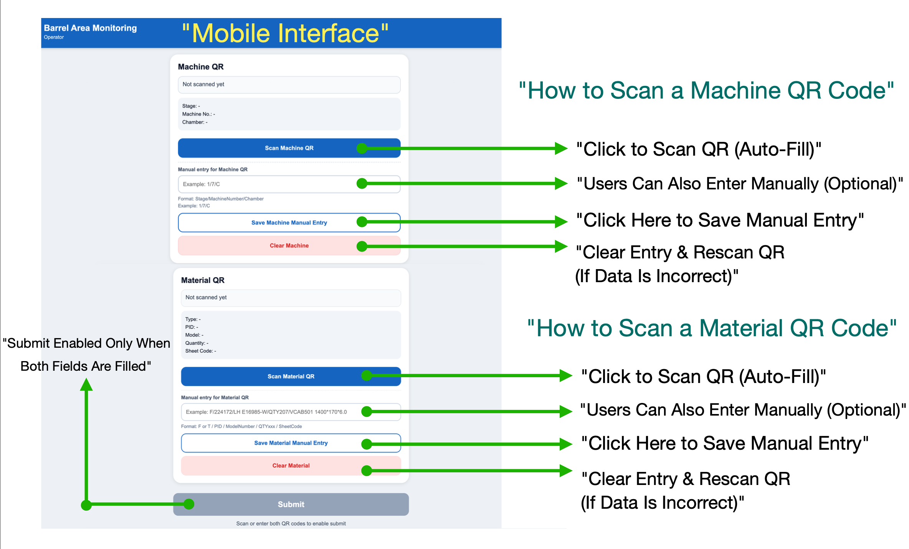
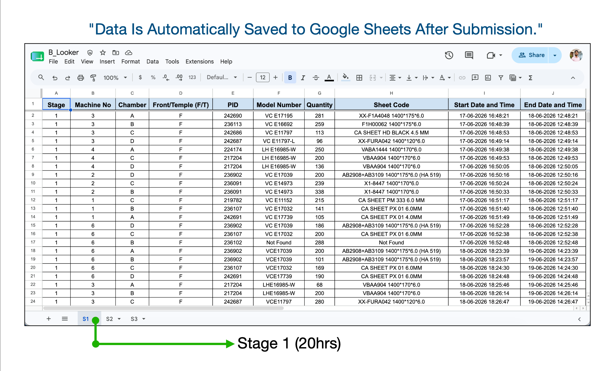
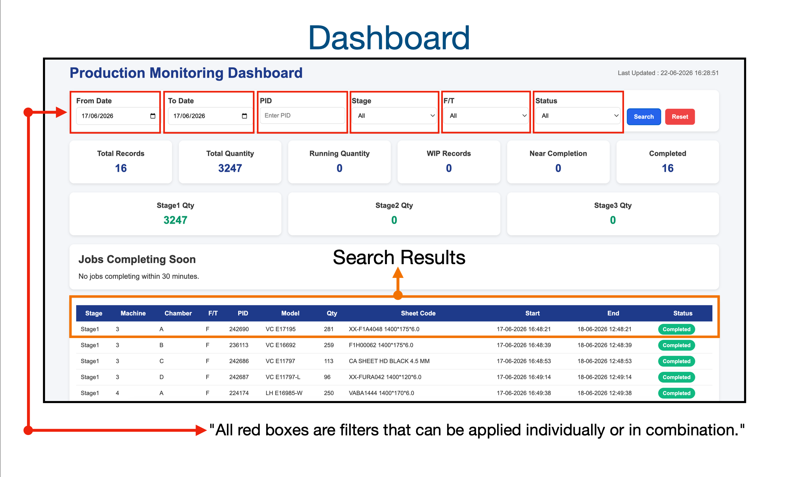

# B_Looker – QR-Based Material & Machine Tracking System

> **Smart Manufacturing | Industrial Automation | QR Tracking | Progressive Web App (PWA) | Google Apps Script | Production Dashboard**

---

# Overview

**B_Looker (Barrel Looker)** is a Smart Manufacturing application developed for the **Barrel (Tumbling) process** in Lenskart's eyewear manufacturing operations.

The Barrel (Tumbling) process is used to smooth and polish eyewear frame components before further manufacturing. B_Looker digitizes this workflow by enabling QR-based machine and material tracking, automating production data collection, storing records in Google Sheets, and providing real-time production monitoring through an interactive dashboard.

The project was developed as both a **Progressive Web App (PWA)** and a **native Android application using Java in Android Studio**, allowing production operators to efficiently perform manufacturing operations on mobile devices.

---

# Project Screenshots

## Mobile Application

---

## QR Workflow

---

## Google Sheets Integration

---

## Production Dashboard

---

# Features

- QR-based Machine & Material Scanning
- Automatic QR Data Validation
- Google Sheets Integration
- Real-Time Production Dashboard
- Progressive Web App (PWA)
- Native Android Application
- Mobile-Friendly User Interface
- Manual Data Entry Support
- Digital Production Tracking
- Real-Time Production Monitoring

---

# Technologies Used

### Programming Languages

- Java
- JavaScript

### Web Technologies

- HTML5
- CSS3

### Mobile Development

- Android Studio
- Progressive Web App (PWA)

### Backend

- Google Apps Script
- Google Sheets

### Deployment

- GitHub Pages

---

# Project Workflow

1. Scan Machine QR Code
2. Scan Material QR Code
3. Validate QR Data
4. Store Production Data in Google Sheets
5. Monitor Production through the Dashboard

---

# Project Highlights

- Developed during my Software & Automation Internship at **Lenskart Pvt. Ltd.**
- Designed and developed both a Progressive Web App (PWA) and a native Android application.
- Automated QR-based machine and material tracking for manufacturing operations.
- Integrated Google Sheets using Google Apps Script for real-time data storage.
- Designed a mobile-first solution for production operators.
- Developed a real-time production dashboard.
- Implemented for production use to support digital machine and material tracking.

---

# Key Learning

- Smart Manufacturing
- Industrial Automation
- Mobile Application Development
- Progressive Web App Development
- QR Code Integration
- Google Apps Script
- Dashboard Development
- Data Validation
- Production Monitoring
- Shop-floor Digitalization

---

# Live Demo

🌐 **Web Application**

https://arjuk4280.github.io/B_Looker/

---

# GitHub Repository

💻 **Repository**

https://github.com/arjuk4280/B_Looker

---

# Author

## Arju Kumar

**Electronics & Communication Engineer**  
Anna University – Dhanalakshmi Srinivasan College of Engineering

**International Professional Master's in Smart Manufacturing & AI**  
NAMTECH

📧 **Email:** kumararju4280@gmail.com

💻 **GitHub:** https://github.com/arjuk4280

---

⭐ If you found this project interesting, please consider giving it a star on GitHub.
